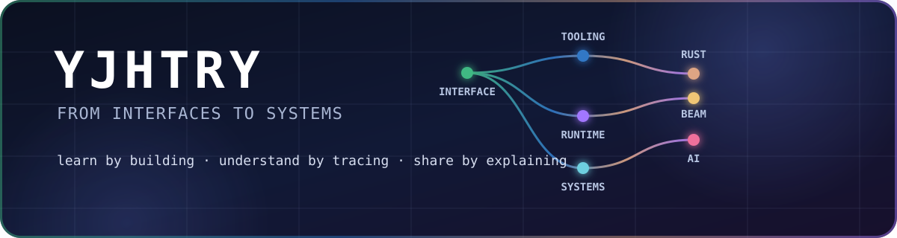

<p align="center">
  
</p>

<p align="center">
  <code>TypeScript</code> · <code>Rust</code> · <code>Elixir</code> · <code>Vue / React</code> · <code>AI-assisted engineering</code>
</p>

## 你好，我是 YJHTRY 👋

我喜欢沿着问题的纵深工作：从用户能触摸到的界面，走到开发者工具、并发运行时和系统边界。

比起追逐技术名词，我更享受把一个概念变成**可运行的项目、可验证的行为和可复用的理解**。

```text
interfaces             developer tools          runtimes & systems
Vue / React / H5  ───▶ TypeScript / CLI  ─────▶ Rust / Tokio / IO
                                  ╲────────────▶ Elixir / OTP / Phoenix

                         AI = learning partner + engineering amplifier
```

## 我正在构建什么

- 🦀 **Rust systems lab** — 从 [rcli](https://github.com/yjhtry/rcli) 的数据处理与协议边界，一路探到 [2025a-rcore](https://github.com/yjhtry/2025a-rcore) 中 RISC-V OS 的 trap、syscall 与 user space。
- 💜 **BEAM experiments** — 用 [elixir-first](https://github.com/yjhtry/elixir-first) 和 [phoenix-first](https://github.com/yjhtry/phoenix-first) 探索 process、supervision、OTP、Phoenix 与 LiveView。
- 🧰 **Tools for builders** — 制作项目脚手架 [create-all](https://github.com/yjhtry/create-all) 与 VS Code 扩展 [open-git-repo](https://github.com/yjhtry/open-git-repo)，关注工具边界、CLI 体验和可维护性。
- 🎨 **Creative web roots** — [projects_three.js](https://github.com/yjhtry/projects_three.js) 记录了我从 Three.js、动画与交互式 Web 开始的创造路径。

## 我的工程偏好

- 先找清楚 contract 和真实 call path，再动手改代码。
- 用最小但完整的 runnable example 拆开抽象概念。
- 对并发、资源生命周期、运行时边界和性能保持好奇。
- 让 AI 放大探索速度，但让代码、测试和实际行为给出最终答案。

## 持续关注

我的 Star 不是收藏夹，而是一张持续整理的技术地图：

`Frontend Engineering` · `Developer Tooling` · `Rust & Systems` · `Backend & Data` · `AI / LLM` · `DevOps`

其中也有公开维护的 [Rust](https://github.com/stars/yjhtry/lists/rust)、[React](https://github.com/stars/yjhtry/lists/react) 和 [Elixir](https://github.com/stars/yjhtry/lists/elixir) 清单。

---

<p align="center">
  <em>Build it small. Trace it deep. Explain it clearly.</em>
</p>
